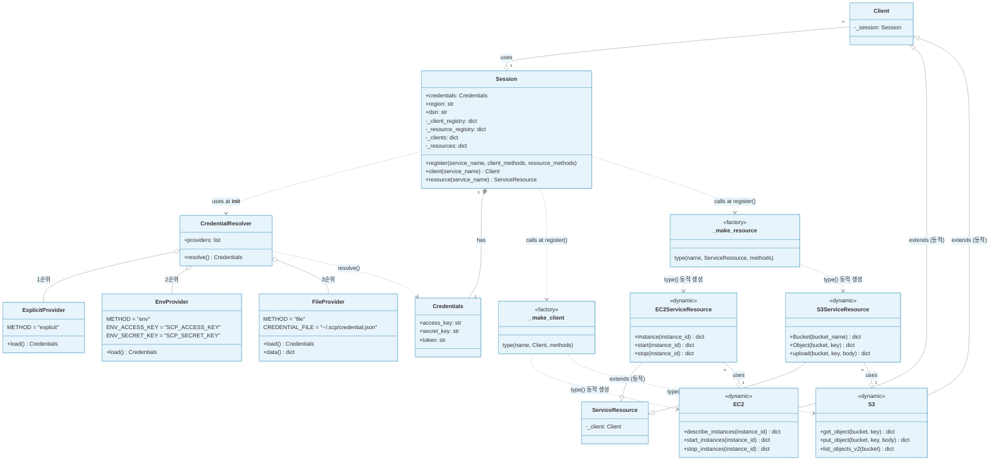

# Component Diagram



## 파일 구조

```
credentials.py      Credentials
                    ExplicitProvider, EnvProvider, FileProvider
                    CredentialResolver
session.py          Client (base), ServiceResource (base)
                    _make_client(), _make_resource()  ← 클래스 동적 생성 팩토리
                    Session                           ← 레지스트리 + 접근 진입점
resources/
    __init__.py     리소스 일괄 등록
    loader.py       ServiceLoader — JSON → 메서드 동적 생성
    data/
        ec2.json    EC2 서비스 정의
        s3.json     S3 서비스 정의
container.py        get_session() — 전역 Session 싱글톤
client.py           get_session().client('ec2')
service_resource.py get_session().resource('s3')
~/.scp/
    credential.json 자격증명 파일 (access_key, secret_key, region, dsn)
main.py             진입점
```

## boto3와의 대응

| boto3 내부 | 이 프로젝트 | 역할 |
|---|---|---|
| `botocore.credentials.Credentials` | `Credentials` | 자격증명 보관 |
| `botocore.credentials.EnvProvider` | `EnvProvider` | 환경변수에서 자격증명 로드 |
| `botocore.credentials.SharedCredentialProvider` | `FileProvider` | 파일에서 자격증명 로드 |
| `botocore.credentials.CredentialResolver` | `CredentialResolver` | 자격증명 체인 관리 |
| `botocore.client.BaseClient` | `Client` | 저수준 API 베이스 |
| `boto3.resources.base.ServiceResource` | `ServiceResource` | 고수준 API 베이스 |
| `ClientCreator.create_client()` | `_make_client()` | `type()`으로 클래스 동적 생성 |
| `ResourceFactory.load_from_definition()` | `_make_resource()` | `type()`으로 클래스 동적 생성 |
| `botocore/data/{service}/service-2.json` | `resources/data/ec2.json` | 서비스 정의 |
| `~/.aws/credentials` + `~/.aws/config` | `~/.scp/credential.json` | 자격증명 + 설정 파일 |
| `boto3.Session` | `Session` | 레지스트리 + 싱글톤 관리 |

## 자격증명 체인 흐름

```
Session() 생성
    → CredentialResolver.resolve()
        → ExplicitProvider.load()   # Session(access_key=...) 로 명시한 경우
              ↓ None이면
        → EnvProvider.load()        # SCP_ACCESS_KEY, SCP_SECRET_KEY 환경변수
              ↓ None이면
        → FileProvider.load()       # ~/.scp/credential.json
              ↓ None이면
        → RuntimeError("자격증명을 찾을 수 없습니다")
```

## 서비스 등록 흐름

```
resources/__init__.py → ServiceLoader.load_all()
    → resources/data/ec2.json 읽기
        → _make_client_method() 로 Client 메서드 동적 생성
        → _make_resource_method() 로 ServiceResource 메서드 동적 생성
        → Session.register('ec2', client_methods, resource_methods)
            → _make_client('ec2', {...}) → type('EC2', (Client,), {...})
            → _make_resource('ec2', {...}) → type('EC2ServiceResource', ...)
            → 레지스트리에 저장

sess.client('ec2') 호출
    → 레지스트리에서 EC2 클래스 조회
    → EC2(session=self) 인스턴스 생성 및 캐시 → 반환
```
