# Component Diagram

```mermaid
%%{init: {'theme': 'base', 'themeVariables': {'primaryColor': '#e8f4fb', 'primaryBorderColor': '#7eb8d4', 'primaryTextColor': '#333', 'lineColor': '#999'}}}%%
classDiagram

    %% ── 스타일 정의 ──
    classDef ivory   fill:#fdfcee,stroke:#c8b89a,color:#333
    classDef sky     fill:#e8f4fb,stroke:#7eb8d4,color:#333
    classDef mint    fill:#eaf7f0,stroke:#7ec4a0,color:#333
    classDef orange  fill:#fef3e8,stroke:#d4a06a,color:#333
    classDef dynamic fill:#eef3fb,stroke:#a0b4d4,color:#555,stroke-dasharray:4 4
    classDef error   fill:#fdecea,stroke:#d47a7a,color:#333
    classDef purple  fill:#f3eefb,stroke:#a07ec4,color:#333

    %% ── exceptions.py ──
    class ScpError {
        <<base exception>>
    }
    class ClientError {
        +response: dict
        +operation_name: str
    }
    class ValidationError
    class CredentialError
    class NoRegionError
    class WaiterError {
        +name: str
        +reason: str
    }
    class PaginationError

    %% ── credentials.py ──
    class Credentials {
        +access_key: str
        +secret_key: str
    }
    class SignatureGenerator {
        +generate(credentials, method, url) tuple
    }
    class ExplicitProvider {
        METHOD = "explicit"
        +load() Credentials
    }
    class EnvProvider {
        METHOD = "env"
        ENV_ACCESS_KEY = "SCP_ACCESS_KEY"
        ENV_SECRET_KEY = "SCP_SECRET_KEY"
        +load() Credentials
    }
    class FileProvider {
        METHOD = "file"
        CREDENTIAL_FILE = "~/.scp/credential.json"
        -_profile_name: str
        +load() Credentials
        +data() dict
    }
    class CredentialResolver {
        +providers: list
        +resolve() Credentials
    }

    %% ── retries.py ──
    class RetryConfig {
        +max_attempts: int
        +mode: str
    }
    class RetryHandler {
        +config: RetryConfig
        +is_retryable(status_code) bool
        +backoff(attempt)
    }

    %% ── session.py ──
    class Client {
        -_session: Session
        -_retry: RetryHandler
        -_service_name: str
        +get_paginator(operation_name) Paginator
        +get_waiter(waiter_name) Waiter
        +_get_headers(api_name, version, method, url) dict
        +_request(http_method, path, ...) dict
        +endpoint: str
    }
    class ServiceResource {
        -_client: Client
    }
    class Session {
        +credentials: Credentials
        +region: str
        +environment: str
        +language: str
        +retry_config: RetryConfig
        -_client_registry: dict
        -_resource_registry: dict
        -_paginator_config_registry: dict
        -_waiter_config_registry: dict
        +register(service_name, ...)
        +client(service_name) Client
        +resource(service_name) ServiceResource
    }
    class _make_client {
        <<factory>>
        type(name, Client, methods)
    }
    class _make_resource {
        <<factory>>
        type(name, ServiceResource, methods+collections)
    }

    %% ── paginator.py ──
    class Paginator {
        +paginate(**kwargs) PageIterator
    }
    class PageIterator {
        +build_full_result() dict
        +__iter__() Iterator
    }

    %% ── waiter.py ──
    class Waiter {
        +name: str
        +wait(**kwargs)
        -_matches(response, acceptor) bool
        -_resolve_path(data, path) Any
    }

    %% ── collection.py ──
    class Collection {
        -_method: Callable
        -_result_key: str
        -_filters: dict
        -_page_size: int
        +all() Collection
        +filter(**kwargs) Collection
        +page_size(size) Collection
        +limit(count) list
        +__iter__() Iterator
    }
    class CollectionManager {
        <<descriptor>>
        -_method_name: str
        -_result_key: str
        +__get__(obj) Collection
    }

    %% ── 동적 생성 클래스 (런타임) ──
    class VPC {
        <<dynamic>>
        +list_vpcs(size, page, ...) dict
        +create_vpc(name, cidr, ...) dict
        +delete_vpc(vpc_id) dict
        +get_paginator("list_vpcs") Paginator
        +get_waiter("vpc_active") Waiter
    }
    class VPCServiceResource {
        <<dynamic>>
        +list(...)
        +create(...)
        +delete(...)
        +vpcs: Collection
    }

    %% ── 스타일 적용 ──
    class ScpError:::error
    class ClientError:::error
    class ValidationError:::error
    class CredentialError:::error
    class NoRegionError:::error
    class WaiterError:::error
    class PaginationError:::error
    class Credentials:::ivory
    class SignatureGenerator:::ivory
    class ExplicitProvider:::orange
    class EnvProvider:::orange
    class FileProvider:::orange
    class CredentialResolver:::orange
    class RetryConfig:::purple
    class RetryHandler:::purple
    class Session:::ivory
    class Client:::sky
    class ServiceResource:::sky
    class _make_client:::mint
    class _make_resource:::mint
    class Paginator:::purple
    class PageIterator:::purple
    class Waiter:::purple
    class Collection:::purple
    class CollectionManager:::purple
    class VPC:::dynamic
    class VPCServiceResource:::dynamic

    %% ── 관계: 예외 계층 ──
    ClientError    --|> ScpError
    ValidationError --|> ScpError
    CredentialError --|> ScpError
    NoRegionError  --|> ScpError
    WaiterError    --|> ScpError
    PaginationError --|> ScpError

    %% ── 관계: 자격증명 체인 ──
    CredentialResolver o-- ExplicitProvider : 1순위
    CredentialResolver o-- EnvProvider      : 2순위
    CredentialResolver o-- FileProvider     : 3순위
    CredentialResolver ..> Credentials      : resolve()

    %% ── 관계: Session ──
    Session ..> CredentialResolver          : uses at __init__
    Session "1" *-- "1" Credentials         : has
    Session "1" *-- "1" RetryConfig         : has
    Session ..> _make_client                : calls at register()
    Session ..> _make_resource              : calls at register()

    %% ── 관계: 팩토리 ──
    _make_client  ..> VPC               : type() 동적 생성
    _make_resource ..> VPCServiceResource : type() 동적 생성

    %% ── 관계: 동적 클래스 ──
    VPC               --|> Client          : extends (동적)
    VPCServiceResource --|> ServiceResource : extends (동적)
    VPCServiceResource "n" --o "1" VPC    : uses
    Client "n" --o "1" Session            : uses

    %% ── 관계: Client 내부 ──
    Client *-- RetryHandler               : has
    Client ..> Paginator                  : get_paginator()
    Client ..> Waiter                     : get_waiter()
    Client ..> SignatureGenerator         : _get_headers()

    %% ── 관계: Paginator ──
    Paginator "1" *-- "1" PageIterator    : creates via paginate()

    %% ── 관계: Collection ──
    CollectionManager ..> Collection      : __get__() 반환
    VPCServiceResource *-- CollectionManager : vpcs (descriptor)
```



---

## 파일 구조

```
scpv2/
├── __init__.py             공개 API (Session, Client, ServiceResource, 예외 클래스 전체 export)
├── session.py              Client / ServiceResource / Session + 동적 팩토리
├── credentials.py          Credentials / SignatureGenerator / Provider 체인 / CredentialResolver
├── exceptions.py           ScpError 계층 (ClientError, ValidationError, WaiterError 등)
├── retries.py              RetryConfig / RetryHandler (지수 백오프 + 지터)
├── response.py             build_response() — ResponseMetadata 래핑
├── paginator.py            Paginator / PageIterator
├── waiter.py               Waiter (_resolve_path 포함)
├── collection.py           Collection / CollectionManager (디스크립터)
├── container.py            get_session() — 전역 Session 싱글톤
├── py.typed                PEP 561 마커
├── stubs/                  자동 생성 .pyi (python scripts/generate_stubs.py)
│   ├── session.pyi
│   ├── vpc_client.pyi
│   └── ...
└── resources/
    ├── __init__.py         ServiceLoader.load_all() 트리거
    ├── loader.py           JSON → 동적 메서드 / CollectionManager 생성 / Session 등록
    └── data/
        ├── vpc.json            paginators / waiters / collections 포함
        ├── virtualserver.json  paginators / waiters / collections 포함
        ├── s3.json             paginators / collections 포함
        ├── ec2.json
        └── subnet.json
```

---

## boto3와의 대응

| boto3 / botocore | scpv2 | 역할 |
|---|---|---|
| `botocore.credentials.Credentials` | `Credentials` | 자격증명 보관 |
| `botocore.credentials.EnvProvider` | `EnvProvider` | 환경변수에서 자격증명 로드 |
| `botocore.credentials.SharedCredentialProvider` | `FileProvider` | 파일에서 자격증명 로드 (다중 프로파일 지원) |
| `botocore.credentials.CredentialResolver` | `CredentialResolver` | 자격증명 체인 관리 |
| `botocore.auth.SigV4Auth` | `SignatureGenerator` | 요청 서명 생성 (HMAC-SHA256) |
| `botocore.exceptions.ClientError` | `ClientError` | API 에러 응답 예외 |
| `botocore.exceptions.BotoCoreError` | `ScpError` | 모든 SDK 예외의 베이스 |
| `botocore.config.Config(retries=...)` | `RetryConfig` | 재시도 정책 설정 |
| `botocore.retries.StandardRetryHandler` | `RetryHandler` | 지수 백오프 재시도 |
| `botocore.parsers.BaseRestParser` | `build_response()` | ResponseMetadata 래핑 |
| `botocore.paginate.Paginator` | `Paginator` | 페이지네이터 |
| `botocore.paginate.PageIterator` | `PageIterator` | 페이지 이터레이터 |
| `botocore.waiter.Waiter` | `Waiter` | 상태 폴링 웨이터 |
| `boto3.resources.collection.ResourceCollection` | `Collection` | 자동 페이지네이션 컬렉션 |
| `boto3.resources.collection.CollectionManager` | `CollectionManager` | 컬렉션 디스크립터 |
| `botocore.client.BaseClient` | `Client` | 저수준 API 베이스 |
| `boto3.resources.base.ServiceResource` | `ServiceResource` | 고수준 API 베이스 |
| `ClientCreator.create_client()` | `_make_client()` | `type()`으로 클래스 동적 생성 |
| `ResourceFactory.load_from_definition()` | `_make_resource()` | `type()`으로 클래스 동적 생성 |
| `botocore/data/{service}/service-2.json` | `resources/data/{service}.json` | 서비스 정의 (paginators/waiters/collections 포함) |
| `~/.aws/credentials` + `~/.aws/config` | `~/.scp/credential.json` | 자격증명 + 설정 (단일/다중 프로파일) |
| `boto3.Session` | `Session` | 레지스트리 + 클라이언트 진입점 |

---

## 자격증명 체인 흐름

```
Session(profile_name="prod") 생성
    → FileProvider(profile_name="prod")
    → CredentialResolver.resolve()
        → ExplicitProvider.load()   # Session(access_key=...) 로 명시한 경우
              ↓ None이면
        → EnvProvider.load()        # SCP_ACCESS_KEY, SCP_SECRET_KEY 환경변수
              ↓ None이면
        → FileProvider.load()       # ~/.scp/credential.json
              단일 형식: {"access_key": ..., "secret_key": ...}
              다중 형식: {"default": {...}, "prod": {...}}
              ↓ None이면
        → CredentialError("자격증명을 찾을 수 없습니다")
```

---

## 서비스 등록 흐름

```
resources/__init__.py → ServiceLoader.load_all()
    → resources/data/vpc.json 읽기
        → _make_client_method()    — client_methods 동적 생성
        → _make_resource_method()  — resource_methods 동적 생성
        → CollectionManager()      — collections 디스크립터 생성
        → Session.register("vpc", client_methods, resource_methods,
                           collection_managers, paginator_configs, waiter_configs)
            → _make_client("vpc", {...})
                → type("VPC", (Client,), {_service_name, list_vpcs, create_vpc, ...})
            → _make_resource("vpc", {...}, {vpcs: CollectionManager})
                → type("VPCServiceResource", (ServiceResource,), {list, create, vpcs})
            → _client_registry["vpc"]            = VPC
            → _resource_registry["vpc"]          = VPCServiceResource
            → _paginator_config_registry["vpc"]  = {"list_vpcs": {...}}
            → _waiter_config_registry["vpc"]     = {"vpc_active": {...}}
```

---

## API 호출 흐름 (Client._request)

```
vpc_client.list_vpcs(size=20, page=0)
    → _make_client_method 생성 클로저 실행
        → _validate(params, required, validations)  # ValidationError 가능
        → Client._request(http_method="GET", path="/v1/vpcs", ...)
            → for attempt in range(RetryConfig.max_attempts):
                → SignatureGenerator.generate()     # 타임스탬프 + 서명
                → requests.get(url, headers, params)
                → 성공(2xx): build_response(data, http_resp, attempt)
                    → {"contents": [...], "ResponseMetadata": {RequestId, HTTPStatusCode, ...}}
                → 재시도 가능(429/5xx) + 시도 여유: RetryHandler.backoff(attempt) → 재시도
                → 재시도 불가: raise ClientError(error_data, "list_vpcs")
```

---

## Paginator 흐름

```
paginator = vpc_client.get_paginator("list_vpcs")
    → Session._paginator_config_registry["vpc"]["list_vpcs"] 조회
    → Paginator(method=vpc_client.list_vpcs, config={...})

for page in paginator.paginate(size=10):
    → PageIterator.__iter__()
        → page=0: vpc_client.list_vpcs(size=10, page=0) → {"contents": [10개]}
        → page=1: vpc_client.list_vpcs(size=10, page=1) → {"contents": [3개]}  ← 10 미만 → 종료
```

---

## Waiter 흐름

```
waiter = vpc_client.get_waiter("vpc_active")
    → Session._waiter_config_registry["vpc"]["vpc_active"] 조회
    → Waiter(name="vpc_active", config={operation, delay, max_attempts, acceptors}, client)

waiter.wait(id="vpc-abc123")
    → for attempt in 1..20:
        → vpc_client.list_vpcs(id="vpc-abc123")
        → acceptor 순회:
            → path "contents[0].vpcState" == "ACTIVE" → return  ✓
            → path "contents[0].vpcState" == "ERROR"  → raise WaiterError  ✗
        → time.sleep(5초)
    → raise WaiterError("max_attempts exceeded")
```

---

## Collection 흐름

```
vpc = sess.resource("vpc")
vpc.vpcs                    # CollectionManager.__get__(vpc) → Collection(list_vpcs, "contents")

for v in vpc.vpcs.filter(vpcState="ACTIVE").page_size(50):
    → Collection.__iter__()
        → page=0: list_vpcs(size=50, page=0, vpcState="ACTIVE") → contents 50개 yield
        → page=1: list_vpcs(size=50, page=1, vpcState="ACTIVE") → contents 12개 yield → 종료
```
